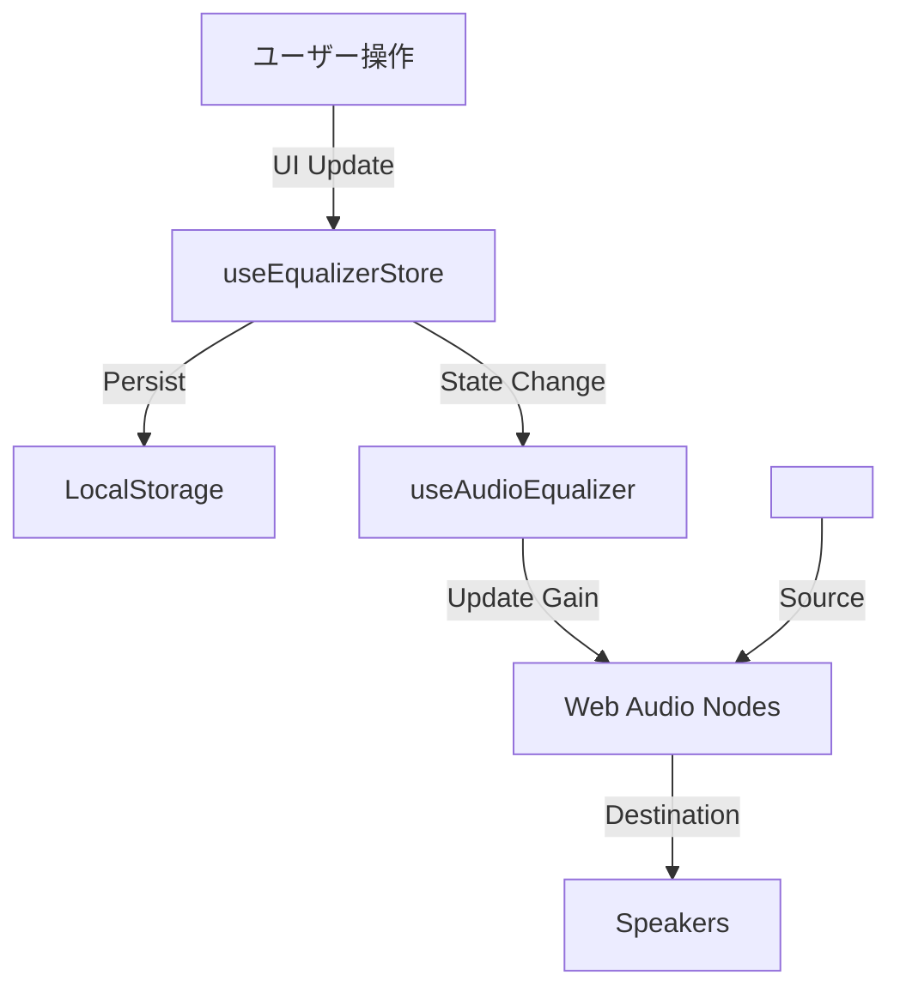

# イコライザー機能 実装計画書

## 1. 概要

`badwave-windows` アプリケーションに、Spotify ライクな 6 バンド・イコライザー（EQ）機能を実装します。
Web Audio API を利用して音声信号をリアルタイムに加工し、ユーザー好みの音質調整を可能にします。設定はローカルに永続化され、次回起動時も維持されます。

## 2. アーキテクチャ

### 2.1 技術スタック

- **Audio Processing**: Web Audio API (`AudioContext`, `BiquadFilterNode`)
- **State Management**: `zustand` (with `persist` middleware for localStorage)
- **UI Components**: React, Tailwind CSS (Radix UI / custom sliders)

### 2.2 データフロー

## 3. 詳細設計

### 3.1 バンド構成 (Spotify 風 6 バンド)

ユーザーが直感的に操作しやすい 6 バンド構成を採用します。

| バンド            | 周波数  | 役割                             |
| :---------------- | :------ | :------------------------------- |
| 低音域 (Bass)     | 60 Hz   | サブベース、重低音の迫力         |
| 中低音域          | 150 Hz  | ベースの輪郭、ドラムの胴鳴り     |
| 中音域            | 400 Hz  | ボーカルの厚み、スネアのボディ   |
| 中高音域          | 1 kHz   | ボーカルの明瞭度、楽器のアタック |
| 高音域            | 2.4 kHz | ギターの抜け、ボーカルの艶       |
| 超高音域 (Treble) | 15 kHz  | 空気感、シンバルのきらめき       |

- **調整範囲**: -12dB ～ +12dB

### 3.2 状態管理 (Store)

**ファイル**: `hooks/stores/useEqualizerStore.ts`

- **State**:
  - `isEnabled`: boolean (EQ の ON/OFF)
  - `bands`: `{ freq: number, gain: number }[]`
  - `activePresetId`: string
  - `presets`: プリセットのリスト
- **Actions**:
  - `setGain(freq, value)`
  - `setPreset(presetId)`
  - `toggleEnabled()`
  - `reset()`

### 3.3 音響処理 (Hook)

**ファイル**: `hooks/audio/useAudioEqualizer.ts`

- `<audio>` 要素の `ref` を受け取り、Web Audio API のグラフを構築します。
- ストアの変更を検知し、リアルタイムに `BiquadFilterNode` のゲインを更新します。
- **注意点**: `<audio>` タグに `crossOrigin="anonymous"` 属性を確実に付与する必要があります。

### 3.4 UI コンポーネント

**ファイル**:

- `components/Equalizer/EqualizerControl.tsx` (メイン UI)
- `components/Equalizer/EqSlider.tsx` (カスタムスライダー)
- `components/Equalizer/FrequencyCurve.tsx` (SVG による曲線描画)

**機能**:

- **プリセット選択**: ドロップダウンまたはタブで選択 (Bass Boost, Vocal, Flat, Custom 等)。
- **スライダー**: 縦型のスライダーを 6 本配置。
- **可視化**: スライダーの背景に、設定値に基づいた滑らかな曲線（ベジェ曲線）を描画し、視覚的なフィードバックを提供します。

## 4. 実装フェーズ

### フェーズ 1: ストアの実装 (TDD)

- `useEqualizerStore` を作成し、ローカルストレージへの保存機能とアクションを実装します。
- プリセットデータ（Bass Boost など）を定義します。

### フェーズ 2: 音響処理フックの実装

- `useAudioEqualizer` を実装し、ダミーのオーディオ要素でノード接続が正しく行われるか検証します。
- `PlayerContent` 内の `<audio>` 要素に統合し、音が変化することを確認します。

### フェーズ 3: UI の実装

- スライダーとプリセット選択 UI を作成します。
- SVG を用いた周波数特性カーブの描画ロジックを実装します。

### フェーズ 4: 統合と微調整

- `PlayerContent` に EQ ボタンを追加し、モーダル/ポップオーバーで UI を表示できるようにします。
- デザイン（色の調整、アニメーション）を調整し、Spotify のようなプレミアム感を演出します。

## 5. テスト計画

- **Unit Test**: ストアのロジック（プリセット切り替え、ゲイン変更）のテスト。
- **Integration Test**: フックがオーディオノードを正しく生成しているか（モックを使用）。
- **Manual Test**: 音質変化の聴感テスト、リロード後の設定維持確認。
