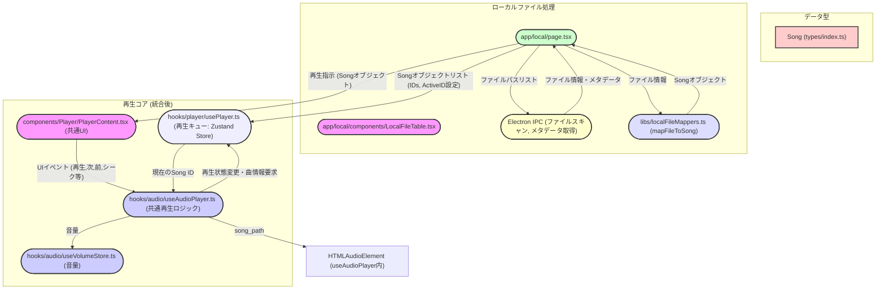

# ローカル再生とストリーミング再生の統合計画

## 1. はじめに

本ドキュメントは、現在のローカルファイル再生機能とストリーミング再生機能を統合するための実装計画をまとめたものです。
統合により、コードの保守性向上、UI の一貫性確保、そして将来的にはローカルファイルとストリーミング曲を混在させた再生体験の実現を目指します。

## 2. 現状分析

### 2.1. ローカル再生

- **UI コンポーネント:**
  - [`app/local/page.tsx`](../app/local/page.tsx): ファイル一覧表示、フォルダ選択、スキャン実行などのメインページ。
  - [`app/local/components/LocalFileTable.tsx`](../app/local/components/LocalFileTable.tsx): ローカルファイル一覧テーブル。
  - [`components/Player/LocalPlayerContent.tsx`](../components/Player/LocalPlayerContent.tsx): ローカルファイル専用の再生コントロール UI。
- **ロジック・フック:**
  - [`hooks/audio/useLocalAudioPlayer.ts`](../hooks/audio/useLocalAudioPlayer.ts): ローカルファイル再生に特化した基本的な音声再生ロジック。
  - Electron IPC: ファイルシステムアクセス（フォルダ選択、ファイルスキャン、メタデータ読み取り）に使用。
- **データフロー:**
  1.  ユーザーがフォルダを選択。
  2.  Electron を介して選択されたフォルダ内の MP3 ファイルをスキャン。
  3.  取得したファイルパスとメタデータ（タイトル、アーティスト、アルバムアートなど）をリスト表示。
  4.  ユーザーがファイルを選択すると、`LocalPlayerContent` を使用して再生。

### 2.2. ストリーミング再生

- **UI コンポーネント:**
  - [`components/Player/PlayerContent.tsx`](../components/Player/PlayerContent.tsx): ストリーミング再生用の多機能な再生コントロール UI（いいね、プレイリスト追加、歌詞表示などを含む）。
  - [`components/Song/MediaItem.tsx`](../components/Song/MediaItem.tsx): 曲情報を表示するコンポーネント。
- **ロジック・フック:**
  - [`hooks/audio/useAudioPlayer.ts`](../hooks/audio/useAudioPlayer.ts): ストリーミング再生用の音声再生ロジック（リピート、シャッフル機能を含む）。
  - [`hooks/player/usePlayer.ts`](../hooks/player/usePlayer.ts): Zustand ストア。再生キュー（曲 ID リスト）、アクティブな曲 ID、リピート・シャッフル状態などを管理。
- **データフロー:**
  1.  ユーザーがオンライン上の楽曲を選択。
  2.  選択された曲の ID が `usePlayer` ストアのアクティブ ID として設定され、再生キューも更新される。
  3.  `PlayerContent` が `useAudioPlayer` を通じて楽曲データ（URL など）を取得し再生。

### 2.3. 型定義 ([`types/index.ts`](../types/index.ts))

- **`Song`**: 楽曲の基本情報（`id`, `user_id`, `author`, `title`, `song_path`, `image_path` など）。
- **`Playlist`**: プレイリスト情報。
- **`PlaylistSong`**: プレイリストと楽曲の関連。

### 2.4. 共通点と相違点

- **共通点:**
  - 基本的な再生 UI（再生/一時停止、次へ、前へ、シークバー、音量調整）のコンセプトは類似。
  - 音量管理には [`hooks/audio/useVolumeStore.ts`](../hooks/audio/useVolumeStore.ts) を共通して使用。
- **相違点:**
  - ローカル再生は Electron によるローカルファイルシステムへのアクセスが主。ストリーミング再生はオンラインの楽曲データが主。
  - 提供される機能（リピート、シャッフル、いいね、プレイリスト操作など）に差がある。
  - 再生ロジックを担うカスタムフックが異なる (`useLocalAudioPlayer` vs `useAudioPlayer`)。
  - 再生コントロール UI コンポーネントが異なる (`LocalPlayerContent` vs `PlayerContent`)。

## 3. 統合の目的

- コードの重複を削減し、保守性を向上させる。
- ローカル再生とストリーミング再生で一貫したユーザーインターフェースを提供する。
- 将来的には、ローカルファイルもストリーミング曲と同様にプレイリストや再生キューで扱えるようにするための基盤を整備する。

## 4. 統合計画

以下のステップで段階的に統合を進めます。

### ステップ 1: `Song` 型のローカルファイル対応強化

ローカルファイルをアプリケーション全体で一貫して `Song` 型として扱えるように、マッピング処理を整備します。

- **対象ファイル:** [`libs/localFileMappers.ts`](../libs/localFileMappers.ts) (主に `mapFileToSong` 関数)
- **対応内容:**
  1.  **`id` の生成:**
      - ローカルファイルパスから一意な `id` を生成する戦略を決定・実装します。（例: `local_` プレフィックス + ファイルパスのハッシュ値、または `local_` + Base64 エンコードされたファイルパス）。これにより、ストリーミング曲の ID との衝突を避けます。
  2.  **`song_path` の形式:**
      - ローカルファイルの絶対パスに `file:///` スキーマを付与した形式で統一します。
  3.  **`image_path` の形式:**
      - Electron で取得したアルバムアートのメタデータ（埋め込み画像など）を Data URL 形式で設定します。
      - または、音楽ファイルと同じディレクトリにある特定の命名規則の画像ファイル（例: `folder.jpg`, `cover.png`）への `file:///` パスを設定します。
  4.  **その他のプロパティ:**
      - `title`, `author`, `duration` などは Electron 経由で取得したファイルメタデータから設定します。
      - `user_id`: `'local_user'` のような固定値を設定するか、`null` とします。
      - `genre`, `count`, `like_count`, `lyrics`: メタデータから取得できれば設定し、なければ `null` または空文字とします。
      - `public`: `false` をデフォルト値とします。
      - `created_at`: ファイルの作成日時または最終更新日時を設定します。

### ステップ 2: 再生ロジックの共通化 (`useAudioPlayer` の拡張)

ストリーミング再生用の `useAudioPlayer` フックを拡張し、ローカルファイルも再生できるようにします。

- **対象ファイル:** [`hooks/audio/useAudioPlayer.ts`](../hooks/audio/useAudioPlayer.ts)
- **対応内容:**
  1.  `songUrl` (または同等のプロパティ) が `file:///` スキーマのローカルファイルパスを受け入れられるように改修します。
  2.  HTML5 `<audio>` 要素の `src` にローカルファイルパスを設定して再生するロジックを実装します。
  3.  [`hooks/audio/useLocalAudioPlayer.ts`](../hooks/audio/useLocalAudioPlayer.ts) に存在する純粋な再生ロジック（Electron 依存部分を除く）を `useAudioPlayer` に統合します。
  4.  リピート (`isRepeating`) およびシャッフル (`isShuffling`) 機能が、ローカルファイル再生時にも `usePlayer` ストアの状態に基づいて動作するようにします。

### ステップ 3: 再生 UI の共通化 (`PlayerContent` の利用)

ストリーミング再生用の `PlayerContent` コンポーネントを、ローカルファイル再生時にも利用できるように改修します。

- **対象ファイル:** [`components/Player/PlayerContent.tsx`](../components/Player/PlayerContent.tsx)
- **対応内容:**
  1.  現在再生中の曲がローカルファイルかストリーミング曲かを判定するロジックを追加します（例: `Song` オブジェクトの `id` のプレフィックスや `song_path` の形式で判定）。
  2.  ローカルファイル再生時には、適用できない UI 要素（いいねボタン、オンラインプレイリスト追加ボタン、歌詞ボタンなど）を非表示にするか、無効化 (disabled) します。
  3.  曲情報表示部分 ([`components/Song/MediaItem.tsx`](../components/Song/MediaItem.tsx)) が、ローカルファイルからマッピングされた `Song` オブジェクトの情報を正しく表示できるように確認・修正します（特に `image_path` の Data URL 対応など）。

### ステップ 4: ローカルファイル再生ページの改修 ([`app/local/page.tsx`](../app/local/page.tsx))

ローカルファイル再生ページを、共通化された再生ロジックと UI コンポーネントを使用するように変更します。

- **対象ファイル:** [`app/local/page.tsx`](../app/local/page.tsx)
- **対応内容:**
  1.  ファイルスキャン後、取得した各ローカルファイル情報を、ステップ 1 で定義したマッピングルールに従って `Song` オブジェクトのリストに変換します。
  2.  ファイル一覧 ([`app/local/components/LocalFileTable.tsx`](../app/local/components/LocalFileTable.tsx)) から曲が選択された際の処理 (`handlePlayFile`):
      - 選択された `Song` オブジェクトの `id` を `usePlayer` ストアの `setId` アクションで `activeId` として設定します。
      - 現在のフォルダ内の全 `Song` オブジェクトの `id` リストを `usePlayer` ストアの `setIds` アクションで再生キューとして設定します。
      - 共通化された `PlayerContent` コンポーネントが表示され、`useAudioPlayer` フックが `activeId` に基づいて再生を開始します。
  3.  「次の曲へ」(`handlePlayNext`) / 「前の曲へ」(`handlePlayPrevious`) の処理:
      - `usePlayer` ストアの `getNextSongId` / `getPreviousSongId` メソッドを利用して、次の/前の曲の `id` を取得します。
      - 取得した `id` を `usePlayer` の `setId` で `activeId` に設定します。再生は `useAudioPlayer` が自動的に処理します。
  4.  [`components/Player/LocalPlayerContent.tsx`](../components/Player/LocalPlayerContent.tsx) と [`hooks/audio/useLocalAudioPlayer.ts`](../hooks/audio/useLocalAudioPlayer.ts) は不要になるため、削除します。

### ステップ 5: 状態管理の統合と確認 (`usePlayer`)

再生キュー管理ストア (`usePlayer`) がローカルファイルとストリーミング曲を区別なく扱えることを確認します。

- **対象ファイル:** [`hooks/player/usePlayer.ts`](../hooks/player/usePlayer.ts)
- **対応内容:**
  1.  `ids` 配列および `activeId` が、ステップ 1 で定義したローカルファイルの `id` (文字列) を問題なく格納・処理できることを確認します。
  2.  現状の実装では `id` は文字列型であるため、大きな変更は不要と想定されますが、念のため動作検証を行います。
  3.  シャッフル機能やリピート機能が、ローカルファイルのみの再生キュー、ストリーミング曲のみの再生キュー、およびそれらが混在した再生キュー（将来的な拡張）で正しく動作するかを考慮します（今回の統合範囲では混在キューは必須ではないが、設計として意識する）。

## 5. 段階的な実施計画（フェーズ分け）

1.  **フェーズ 1: 基盤整備と型対応**
    - ステップ 1: `Song` 型のローカルファイル対応強化。
    - ステップ 2 の一部: `useAudioPlayer` が `file:///` パスを受け付け、基本的な再生・一時停止・シークができるようにする。
2.  **フェーズ 2: ローカル再生 UI の置き換えと基本機能統合**
    - ステップ 3: `PlayerContent` のローカルファイル対応（UI 要素の出し分け）。
    - ステップ 4: `app/local/page.tsx` で共通コンポーネントとフックを使用するように変更。既存のローカル再生と同等の機能（リピート・シャッフルなし）を実現。
    - `LocalPlayerContent` と `useLocalAudioPlayer` を削除。
3.  **フェーズ 3: 機能拡張**
    - ステップ 2 の残り: `useAudioPlayer` にリピート・シャッフル機能を完全に統合し、ローカル再生でも利用可能にする。
4.  **フェーズ 4: 状態管理の最終確認とリファクタリング（オプション）**
    - ステップ 5: `usePlayer` ストアの動作をローカルファイル ID で徹底的にテスト。
    - コード全体のクリーンアップとドキュメント整備。

## 6. 確認事項・懸念点

- **ローカルファイルの ID 生成戦略:**
  - ファイルパスのハッシュ化、プレフィックス付きファイルパスなど、具体的で堅牢な方法を確定する必要があります。
- **`mapFileToSong` の実装詳細:**
  - [`libs/localFileMappers.ts`](../libs/localFileMappers.ts) の `mapFileToSong` 関数の具体的な実装を確認し、`Song` 型へのマッピング（特に `image_path` の扱いや不足プロパティのデフォルト値）を詳細に詰める必要があります。
- **ID 衝突の可能性:**
  - ストリーミング曲の ID 体系とローカル曲の ID 体系が衝突しないことを保証する仕組みが必要です（プレフィックス戦略が有効）。
- **パフォーマンス:**
  - 多数のローカルファイルをスキャン・マッピングする際のパフォーマンスに注意が必要です。
- **エラーハンドリング:**
  - ファイルパスが無効な場合、メタデータが取得できない場合などのエラーハンドリングを適切に行う必要があります。

## 7. Mermaid 図 (コンポーネント構成とデータフロー)

以上
