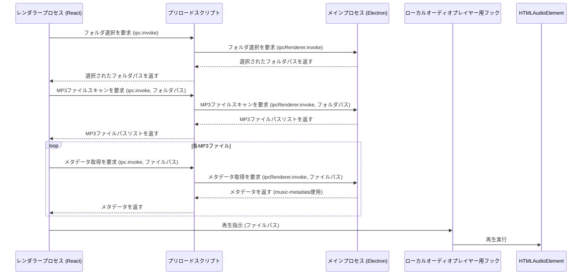

# ローカル MP3 再生機能 実装計画 (修正版)

## 1. 目的

既存の Web ベースの音楽再生機能に加え、ユーザーがローカルに保存している MP3 ファイルをスキャンし、アプリケーション内で再生できるようにする。

## 2. 主な機能要件

- サイドバーに「ローカル」タブを追加する。
- 「ローカル」タブ内で、ユーザーがフォルダを選択できる機能を提供する。
- 選択されたフォルダ内の MP3 ファイルをスキャンし、リスト表示する。
- MP3 ファイルのメタデータ（曲名、アーティスト名、アルバム名、アートワークなど）を `music-metadata` (ver7 系) を使用して抽出し、表示する。
- リストから MP3 ファイルを選択し、再生できるようにする。
- 既存のオーディオ再生フック ([`hooks/audio/useAudioPlayer.ts`](hooks/audio/useAudioPlayer.ts)) とは独立した、新しいオーディオ再生フックを作成する。
- 既存のプレイヤー UI ([`components/Player/PlayerContent.tsx`](components/Player/PlayerContent.tsx)) を参考に、ローカル再生専用のプレイヤー UI コンポーネントを作成する（モバイルプレイヤーは不要）。
- **ローカルファイル再生においては、「お気に入り登録」「プレイリストへの追加」「歌詞表示」の機能は対象外とする。**

## 3. 実装方針

### 3.1. UI コンポーネントの作成・変更

- **サイドバー ([`components/Sidebar/Sidebar.tsx`](components/Sidebar/Sidebar.tsx))**:
  - `routes` 配列に「ローカル」タブのエントリを追加する。
  - 「ローカル」タブが選択された際に表示する専用のページコンポーネントを作成する。
- **ローカル再生ページコンポーネント (新規作成)**:
  - フォルダ選択ボタンを配置する。
  - 選択されたフォルダ内の MP3 ファイルリストを表示するエリアを設ける。
  - MP3 ファイルをクリックした際に再生が開始されるようにする。
- **ローカルプレイヤーコンポーネント (新規作成 - `LocalPlayerContent.tsx` など)**:
  - [`components/Player/PlayerContent.tsx`](components/Player/PlayerContent.tsx) をベースに、ローカル再生に必要な UI 要素（再生/一時停止、進む/戻る、シークバー、音量調整など）を実装する。
  - モバイルプレイヤー関連のコードは削除する。
  - 曲情報表示部分には、`music-metadata` で取得したメタデータを表示する。
  - **「お気に入りボタン」「プレイリスト追加ボタン」「歌詞表示ボタン」は含めない。**

### 3.2. オーディオ再生ロジック (フック)

- **ローカルオーディオプレイヤー用フック (新規作成 - `useLocalAudioPlayer.ts` など)**:
  - [`hooks/audio/useAudioPlayer.ts`](hooks/audio/useAudioPlayer.ts) を参考に、ローカルファイル再生に特化したフックを作成する。
  - HTML5 の `<audio>` 要素を直接操作し、再生、一時停止、シーク、音量調整などの機能を提供する。
  - 再生状態（再生中、一時停止中、再生時間、曲の長さなど）を管理する。

### 3.3. Electron 連携 (メインプロセスとレンダラープロセス)

- **Electron メインプロセス ([`electron/main.ts`](electron/main.ts))**:
  - フォルダ選択ダイアログを表示するための IPC ハンドラ (`handle-select-directory` など) を追加する。
    - `dialog.showOpenDialog` を使用してフォルダ選択ダイアログを表示する。
  - 指定されたフォルダ内の MP3 ファイルをスキャンし、ファイルパスのリストを返す IPC ハンドラ (`handle-scan-mp3-files` など) を追加する。
    - Node.js の `fs` モジュールを使用してファイルシステムを操作する。
  - 指定された MP3 ファイルのメタデータを `music-metadata` (ver7 系) を使用して抽出し、結果を返す IPC ハンドラ (`handle-get-mp3-metadata` など) を追加する。
- **Electron プリロードスクリプト ([`electron/preload.ts`](electron/preload.ts))**:
  - 上記で作成した IPC ハンドラをレンダラープロセスから安全に呼び出すための関数を `contextBridge.exposeInMainWorld` を介して公開する。
  - `ALLOWED_INVOKE_CHANNELS` に新しいチャンネル名を追加する。

### 3.4. データフロー



### 3.5. パッケージのインストール

- `music-metadata` のバージョン 7 系をインストールする。
  ```bash
  npm install music-metadata@7
  ```
  または
  ```bash
  yarn add music-metadata@7
  ```

### 4. 実装ステップ

1.  **Electron 連携の準備**:
    - [`electron/main.ts`](electron/main.ts) にフォルダ選択、MP3 スキャン、メタデータ取得用の IPC ハンドラを追加する。
    - [`electron/preload.ts`](electron/preload.ts) に上記の IPC ハンドラを呼び出すための関数を公開する。
2.  **サイドバーの変更**:
    - [`components/Sidebar/Sidebar.tsx`](components/Sidebar/Sidebar.tsx) に「ローカル」タブを追加する。
3.  **ローカル再生ページコンポーネントの作成**:
    - フォルダ選択ボタンを実装し、Electron 連携でフォルダパスを取得する。
    - 取得したフォルダパスを元に MP3 ファイルをスキャンし、リスト表示する。
    - 各 MP3 ファイルのメタデータを取得し、表示する。
4.  **ローカルオーディオプレイヤー用フックの作成**:
    - 基本的な再生制御機能（再生、一時停止、シーク、音量）を実装する。
5.  **ローカルプレイヤーコンポーネントの作成**:
    - [`components/Player/PlayerContent.tsx`](components/Player/PlayerContent.tsx) を参考に UI を構築する。
    - ローカルオーディオプレイヤー用フックと連携させる。
    - **お気に入り、プレイリスト、歌詞関連の UI 要素は含めない。**
6.  **全体の結合とテスト**:
    - 各コンポーネントとフックを結合し、ローカル MP3 ファイルの選択から再生までの一連の流れをテストする。
    - メタデータ表示の正確性を確認する。

### 5. 懸念事項・確認事項

- 大量の MP3 ファイルをスキャンする場合のパフォーマンス。
- `music-metadata` で対応していないメタデータ形式や、破損したファイルへの対応。
- アートワークの表示方法（埋め込みアートワークの抽出と表示）。
- エラーハンドリング（ファイルアクセスエラー、メタデータ取得エラーなど）。
